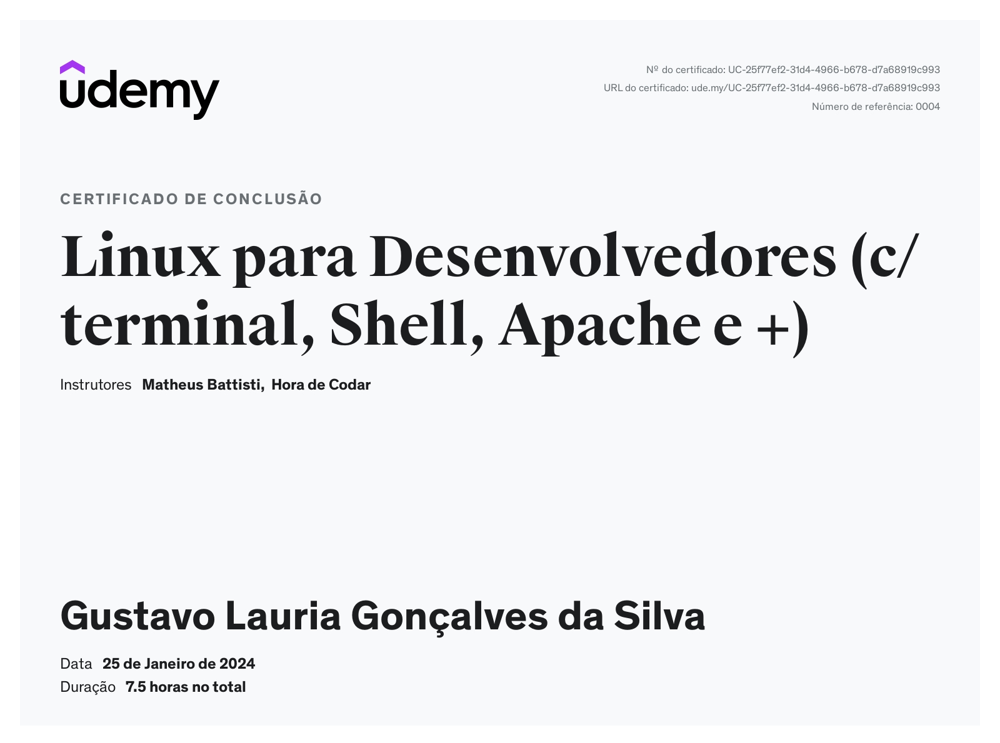

# Exercícios

- Todos os arquivos gerados e feitos para a conclusão do Desafio dessa Sprint estão na pasta **arquivos** dentro do diretório **desafio**

# Evidências

- As imagens que foram obtidas ao longo da execução do desafio também podem ser encontradas na pasta **img** dentro do diretório **desafio**

# Certificados

- Aqui serão armazenados todos os certificados obtidos na Sprint

- Certificado do Curso Git

# Resumos

- Parte do conteúdo que foi aprendido durante essa Sprint

