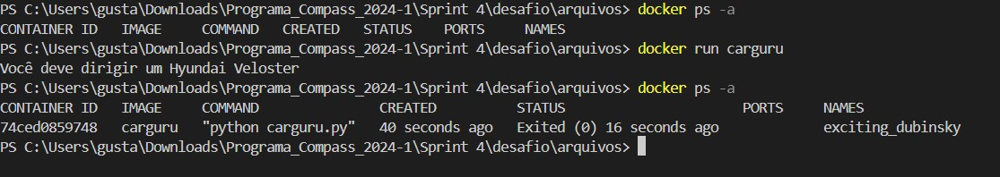
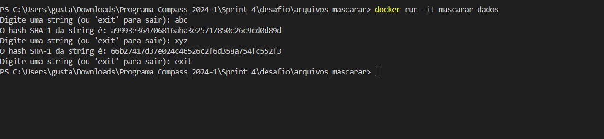

# Descrição

- Nesse arquivo será armazenado o passo a passo, comentado e com prints, da execução do desafio da Sprint e todos os códigos fonte utilizados.

- O diretório **arquivos** conterá todos os arquivos gerados no desafio, sejam eles de texto *(.txt)*, de codigo fonte *(.sh)* , etc.
- O diretório **img** conterá todos os prints tirados ao longo da execução do desafio.

## Passo a Passo

1. Primeiro, baixamos o arquivo *carguru.py* que nos foi fornecido e iniciamos o ambiente do Docker, já que iremos utilizá-lo em breve.

2. Com o ambiente Docker funcionando, fazemos o *build* da imagem do nosso arquivo utilizando um **Dockerfile**, como mostra o print  e com a imagem pronta podemos rodar o nosso container,  

3. A segunda etapa é na verdade uma pergunta, 'É possível reutilizar containers ?', que foi respondida no . Em resumo, sim, é possível, e foi algo recorrente ao longo do desafio, para fazer os testes nos containers.

4. Indo para Etapa 3, agora tivemos que criar um programa do zero, utilizando a biblioteca **hashlib** pra imprimir o hash de qualquer string dada.

5. Após a criação do arquivo mascarar.py, fazemos o *build* da imagem, como mostra o print   e rodamos o nosso container, 