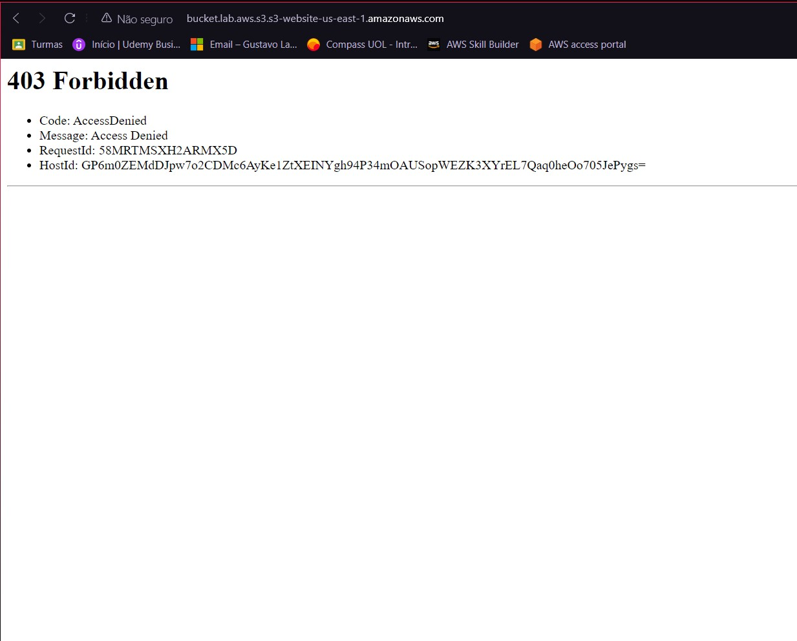

# Descrição

- Nesse arquivo será armazenado o passo a passo, comentado e com prints, da execução do laboratório 1 desta Sprint.

## Passo a Passo

1. Utilizando o **S3** criamos o nosso bucket, *'bucket.lab.aws.s3'*, que será utilizado para hospedar um site.

2. Como podemos ver abaixo, ao acessarmos o endpoint do nosso bucket, recebemos um erro de 'acesso negado', já que o nosso bucket não está com as configurações corretas.
 

3. Mudamos as configurações do nosso bucket, para habilitar o acesso público, mas agora temos um outro erro, que nos mostra que o arquivo *index.html* não foi encontrado, isso porque ainda não o adicionamos no bucket. 

4. Fazendo o upload do arquivo *index.html*, e do arquivo *nomes.zip*(que será utilizado no futuro), temos o nosso site funcionando. 

5. Finalizamos criando um arquivo de erro, *404.html*, e temos então a conclusão desse primeiro laboratório. 