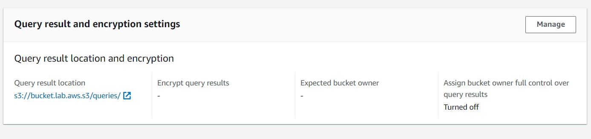
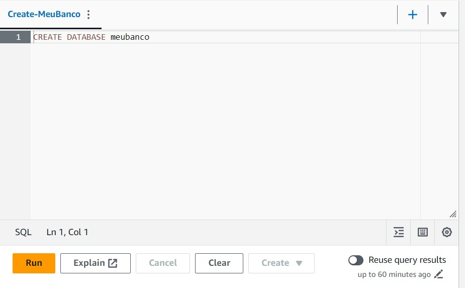
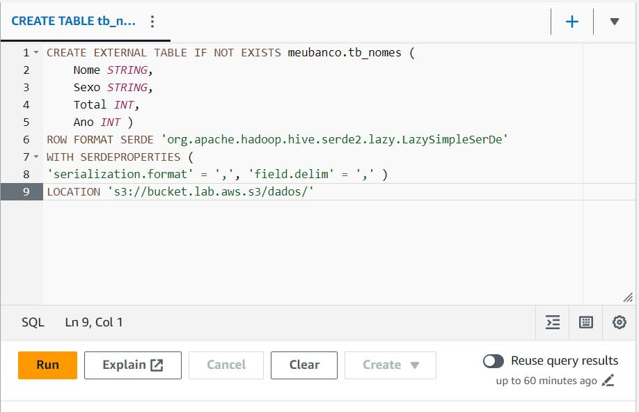
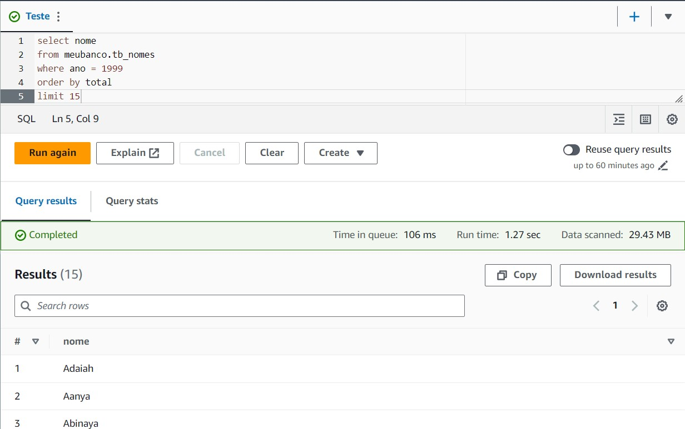
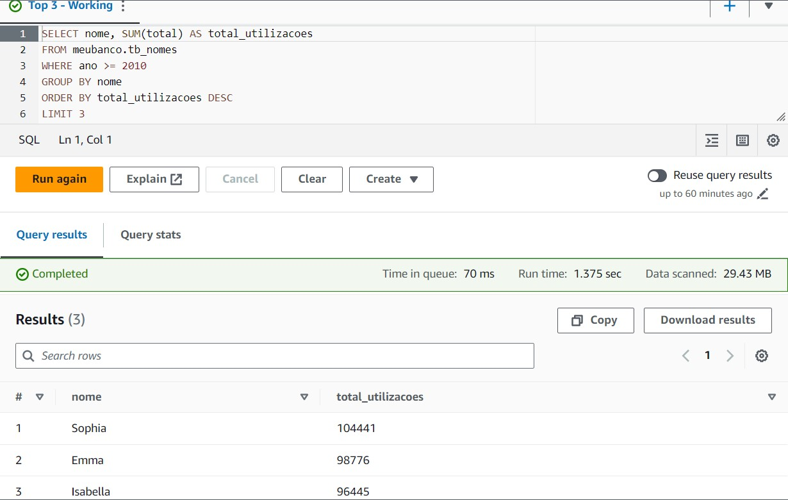

# Descrição

- Nesse arquivo será armazenado o passo a passo, comentado e com prints, da execução do laboratório 2 desta Sprint.

#### OBS .: *Todo código SQL mostrado a seguir tambem esta disponível em arquivos .sql, separados na pasta **arquivos** *

## Passo a Passo

1. Primeiro selecionamos o local em que queremos armazenar as nossas futuras queries. Como mostra na figura abaixo, criamos uma pasta chamada *queries*, no bucket criado no ultimo laboratório, que servirá esse propósito. 

2. Agora temos que criar o database que será utilizado para fazermos nossa queries, com o nome de *meubanco*. 

3. Temos tambem que criar a tabela baseada nos dados do nosso bucket, para fazermos as consultas. 

4. Fazemos uma consulta teste, a fim de checar se tudo está correndo bem. 

5. O passo final, é criar uma consulta que lista os 3 nomes mais usados em cada década desde o 1950 até hoje. Para isso, foi feita inicialmente uma query teste, que retorna apenas os 3 nomes mais usados no periodo selecionado. Essa query serve para termos certeza de que estamos pegando os nomes certos.  

6. Finalmente criamos a query que retorna os nomes mais utilizados de cada década. 