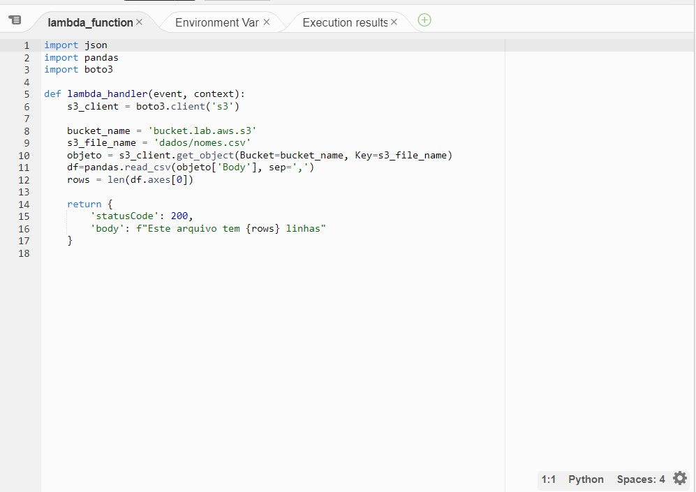
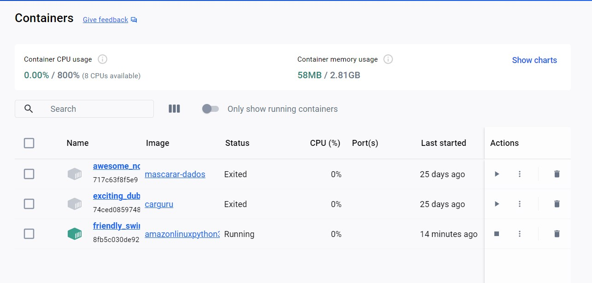

# Descrição

- Nesse arquivo será armazenado o passo a passo, comentado e com prints, da execução do laboratório 3 desta Sprint.

## Passo a Passo

1. Para esse laboratório, iremos criar uma função lambda que interage com o bucket criado previamente. Ao criarmos nossa função, vemos que o Python 3.7 não é mais suportado pela AWS, e portanto teremos que trabalhar com o Python 3.9 . 

2. Após criada, inserimos na nossa função o código que deverá ser rodado. Ele nos retorna um status, e o número de linhas do arquivo. 

3. Ao executar a nossa função, recebemos um erro de 'import'. Para corriji-lo precisaremos criar um **Layer**. Utilizando o Docker, criamos uma [Dockerfile](arquivos/Dockerfile), e fazemos o 'build' e o 'run' de um container Docker, *amazonlinuxpython* 
