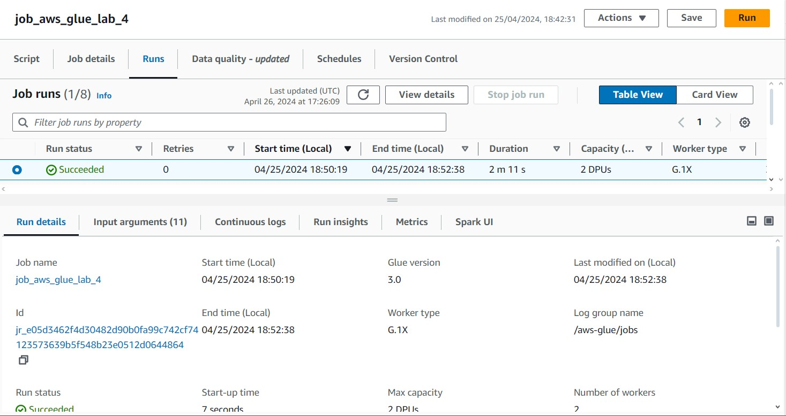
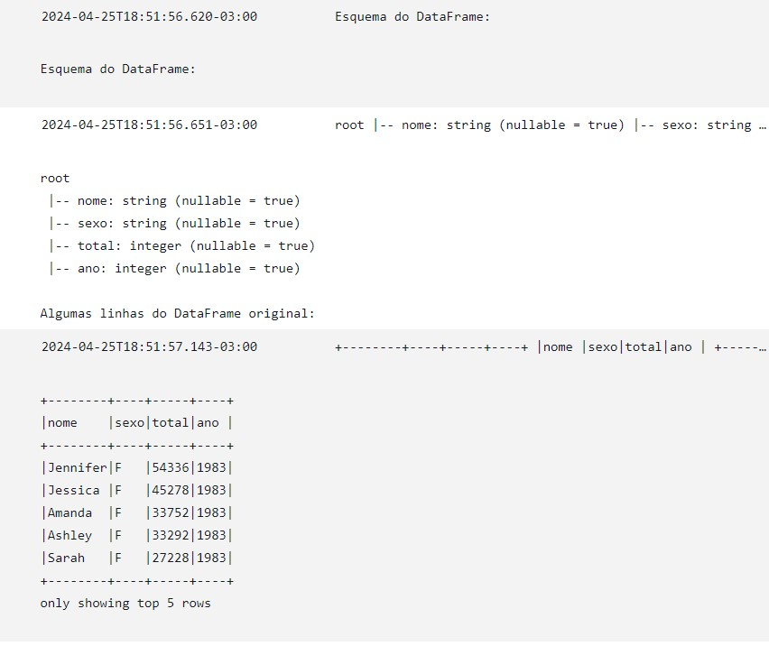
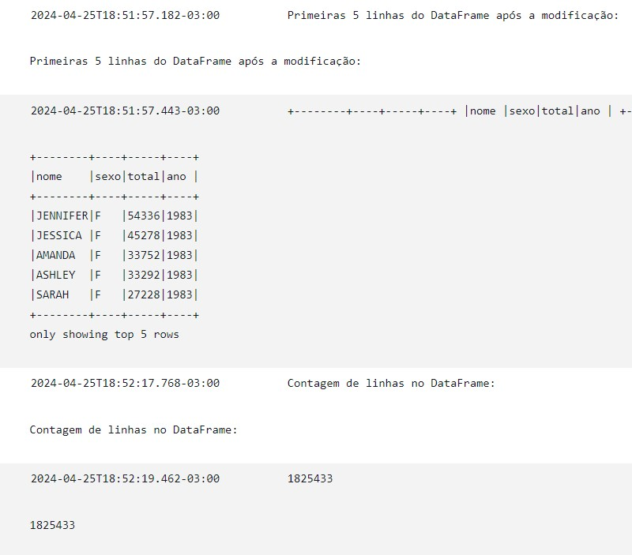
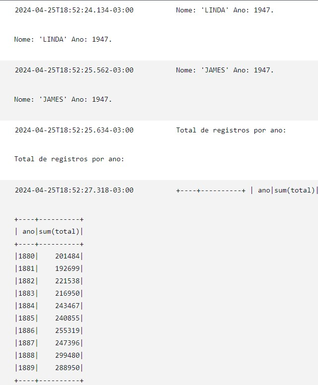
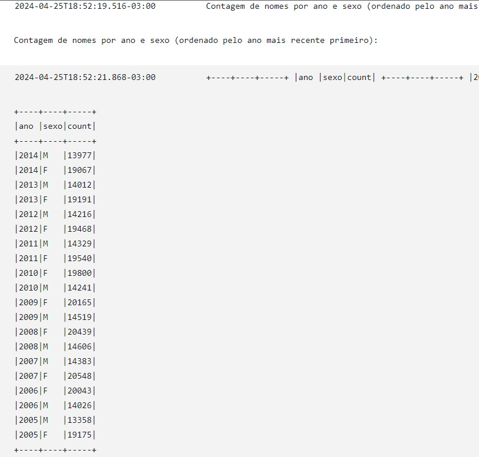
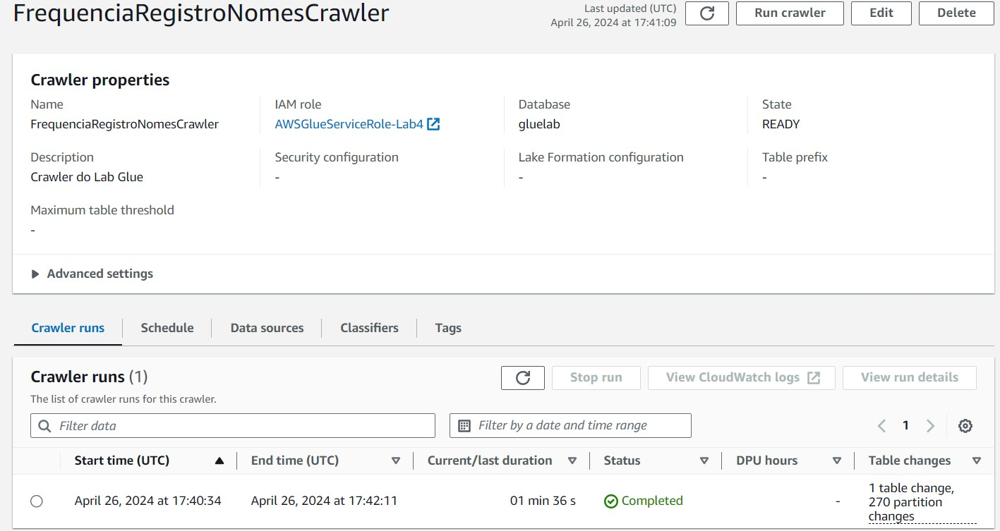
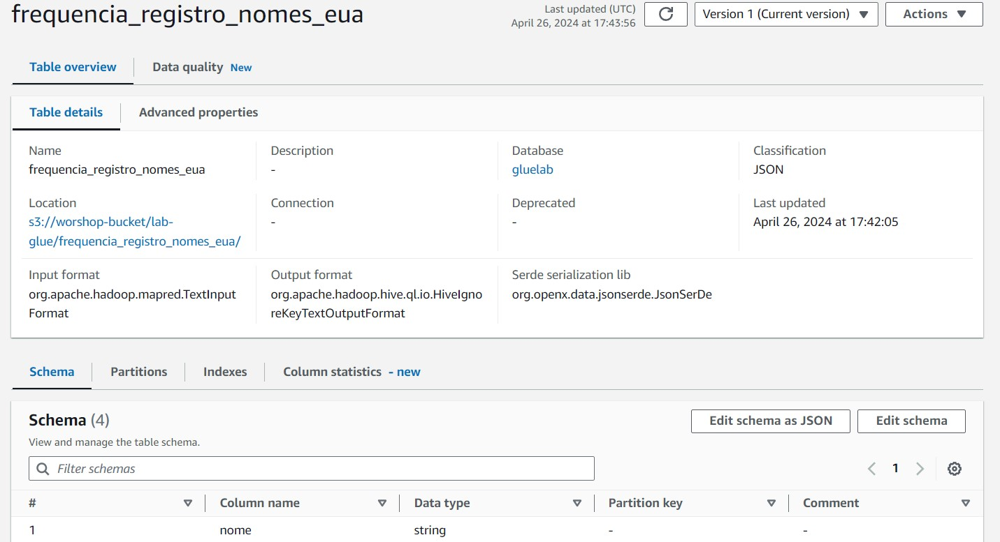

# Descrição

- Nesse arquivo será armazenado o passo a passo, comentado e com prints, da execução do laboratório de GLUE desta Sprint.

#### OBS .: *Todo código Python mostrado a seguir tambem esta disponível em arquivos .py, separados na pasta **arquivos** *

## Passo a Passo

1. Fazemos o download do nosso arquivo *nomes.csv*, e o upload do mesmo para o nosso novo bucket do S3, *workshop-bucket*, que será utilizado exclusivamente para esse lab.

2. Depois de fazer todas as configurações necessárias, criamos o nosso database *gluelab*, que será utilizado mais a frente.

3. Chegamos agora na parte principal, a criação do nosso **job**, configuramos todas as propriedas necessárias, e partimos para o nosso script, que le o nosso arquivo *nomes.csv* do S3, cria um dataframe spark, e executa uma série de comandos, finalizando na criação de um subdiretório no bucket do S3, *frequencia_registro_nomes_eua*, que possui as partições do nosso dataframe. 

4. Finalmente, criamos um *crawler*, que automaticamente cria pra nós a tabela *frequencia_registro_nomes_eua* na base do database *gluelab*.

