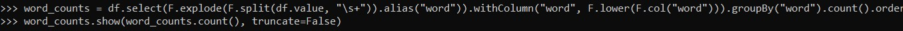

# Descrição

- Nesse arquivo será armazenado o passo a passo, comentado e com prints, da execução do laboratório 2 desta Sprint.

#### OBS .: *Todo código Python mostrado a seguir tambem esta disponível em arquivos .py, separados na pasta **arquivos** *

## Passo a Passo

1. Iniciamos esse exercício fazendo o upload da imagem *jupyter/all-spark-notebook* através do **Docker**

2. Com a imagem carregada, rodamos um container Docker em modo iterativo. A partir desse container, conseguimos executar o *pyspark*, que é onde faremos programa.

3. Como o nosso programa se trata de um contador de palavras, cujo alvo é o **README.md** principal desse repositório, precisamos utilizar o comando **wget** para baixarmos o arquivo para o nosso container.

4. Com o arquivo em mãos, executamos o nosso script, que nos retorna a quantidade de cada palavra da nossa página.

