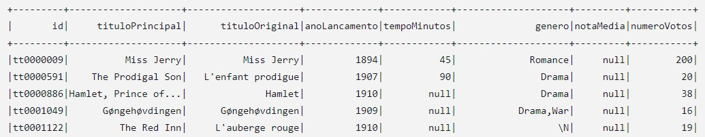
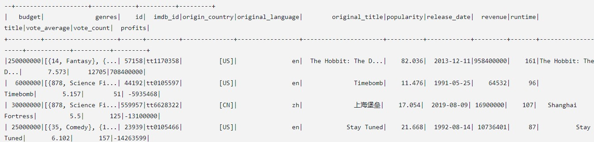

# Descrição

- Nesse arquivo será armazenado o passo a passo, comentado e com prints, da execução do desafio da Sprint e todos os códigos fonte utilizados.

- O diretório **arquivos** conterá todos os arquivos gerados no desafio, sejam eles de texto *(.txt)*, de codigo fonte *(.sh)* , etc.
- O diretório **img** conterá todos os prints tirados ao longo da execução do desafio.

## Passo a Passo

1. Nesse desafio, fizemos a nossa camada **Trusted**, utilizando o Spark, e contendo as informações que serão necessárias para nossa futura análise. Para isso foram necessários 2 *jobs* do **AWS GLUE**, um para tratar as informações provindas do arquivo *.csv*, e outra para os arquivos *.json*.

2. Começando com o nosso primeiro job, fazemos a leitura do arquivo csv para o dataframe do Spark, já fornecendo o Schema correto dele, e as únicas mudanças que fizemos foi a exclusão de algumas linhas e colunas. As colunas excluídas traziam informações sobre os personagens dos filmes, e como a nossa análise não será focada nisto, podemos prosseguir sem essas informações.

3. Também fizemos um tratamento nas linhas, excluindo as que possuiam filmes duplicados, usando o id como base para essa exclusão.

4. No final, possuimos somente as colunas que serão relevantes para nossa analise, e fazemos a exportação em formato *parquet* para a camada **Trusted** do nosso *data-lake* no S3.

- *Output Final:*

5. Fazendo agora o nosso segundo job, sobre os dados provindos do **TMDB**, desta vez trabalhamos com vários arquivos *json*, e com um Schema bem mais complicado, de várias colunas, e por isso, deixamos o Spark fazer a inferência do mesmo. Como os arquivos não possuem muitos dados, e estão todos no mesmo formato, a inferência de Schema funciona bem.

6. Posteriormente, fazemos aqui também a exclusão de múltiplas colunas que não serão utilizadas na nossa análise, como informação sobre as produtoras, o status dos filmes, entre outros.

7. Fazemos também a adição de uma nova coluna *profits*(lucro), que é a diferença entre a bilheteria(*revenue*) e o orçamento(*budget*). Esse dado será bem importante para nossa futura análise.

8. Finalmente, fazemos a exportação em formato *parquet* para o bucket no S3. Essa exportação deveria ser particionada por alguma data relevante, fosse ela o ano de lançamento do filme, ou a data em que ele foi ingerido para o S3, mas como estamos trabalhando com um volume de dados muito pequeno(menos de 1MB), esse particionamento por data foi julgado não necessário, e foi deixado apenas o particionamento automático da função *write.parquet* do Spark, que particiona em 4 o arquivoo.

- *Output Final:*

