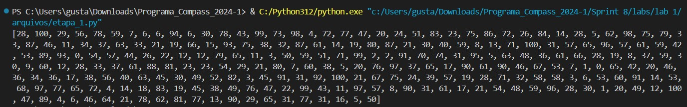
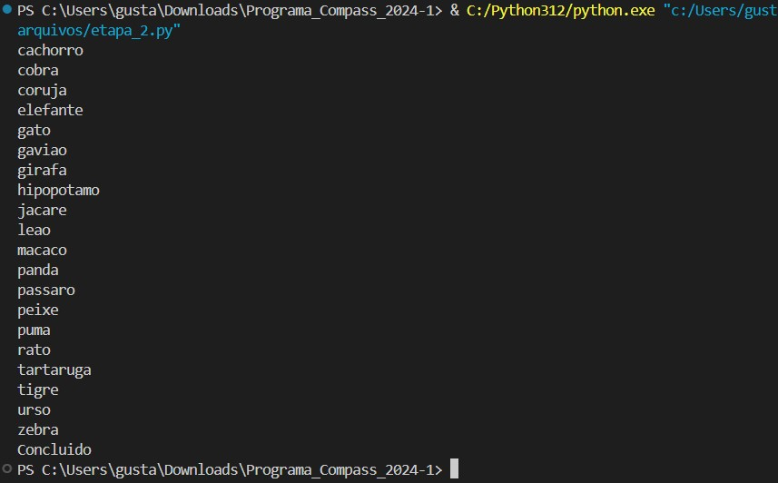
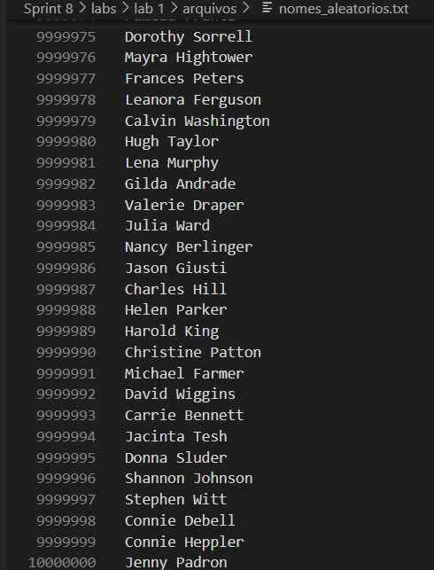

# Descrição

- Nesse arquivo será armazenado o passo a passo, comentado e com prints, da execução do laboratório de Python desta Sprint.

## Passo a Passo

1. A primeira etapa consistia em criar uma lista contendo 250 inteiros aleatórios, aplicar o metodo reverse e imprimir seu resultado

2. A segunda etapa consiste em criar uma lista contendo o nome de 20 animais, ordena-los de forma crescente, e imprimi-los 1 a 1, tanto na tela, quanto num arquivo csv, nomeado *list_animais.csv*.

3. A etapa 3 é um pouco mais elaborada, nela criamos um dataset de nomes de pessoas, usando a biblioteca **names**.

4. Importamos as bibliotecas que iremos utilizar (**names**, **time**, **random**), e os parametros que precisamos, que são a quantidade de nomes únicos, e aleatórios.

5. Depois, usando dois *for loops* fazemos os comandos necessarios para gerar os nossos nomes aletorios, e guardamos eles no arquivo *nomes_aleatorios.txt*.

*OBS.: O arquivo nomes_aleatorios.txt passa do limite de tamanho para o GitHub, e portanto não esta presente neste repositório.*