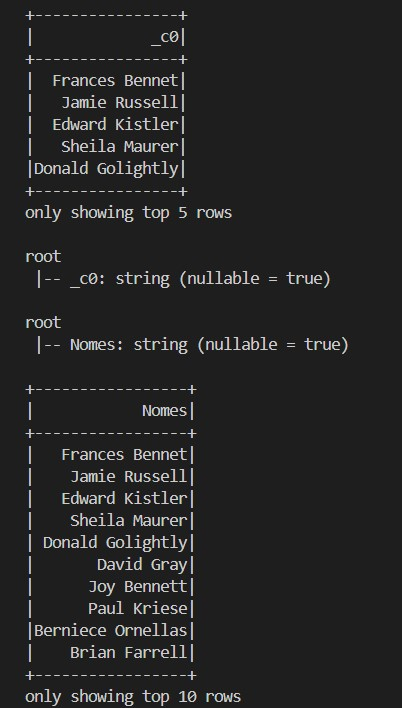
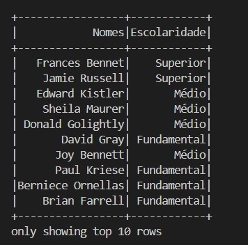
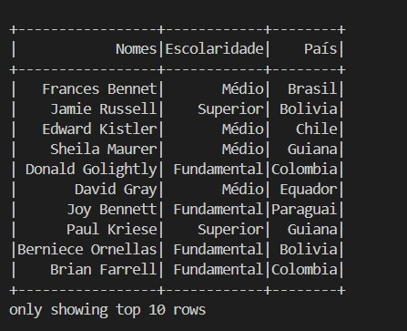
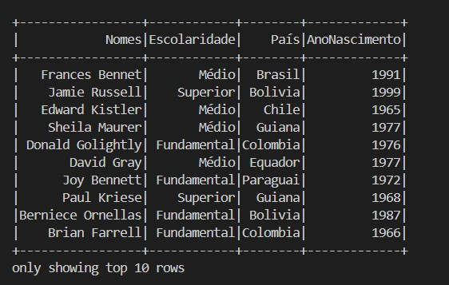
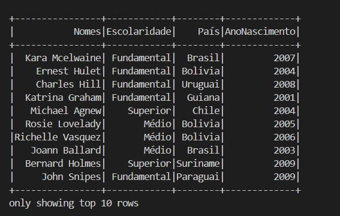
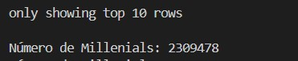
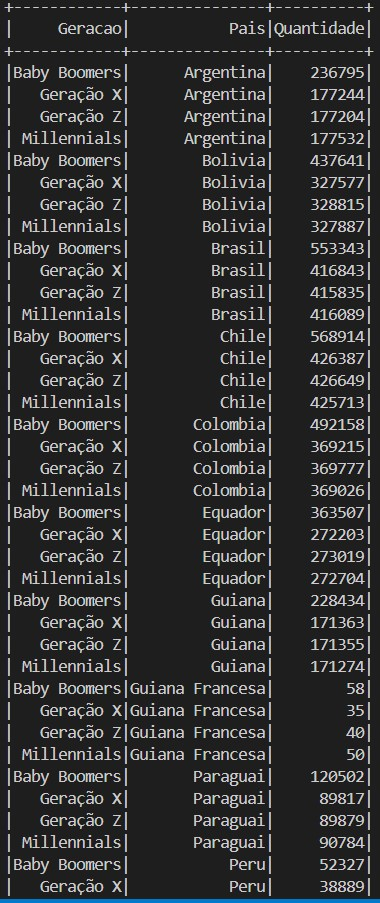

# Descrição

- Nesse arquivo será armazenado o passo a passo, comentado e com prints, da execução do laboratório de Spark desta Sprint.

#### OBS .: *Todo código Python mostrado a seguir tambem esta disponível em arquivos .py, separados na pasta **arquivos** *

## Passo a Passo

1. Nesse laboratório, usaremos o arquivo *nomes_aleatorios.txt*, criado no ultimo laboratorio para criar um dataframe e testarmos comandos SQL.

2. Na primeira etapa, fazemos a criação do nosso dataframe no Spark, usando o nosso arquivo *nomes_aleatorios.txt*, e vemos algumas linhas.

3. Na etapa 2, vemos o *schema* inferido pelo Spark para o nosso dataframe, e alteramos o nome da primeira coluna de *c0*, para *Nomes*.

4. Na terceira etapa, adicionamos uma nova coluna **Escolaridade**, e atribuimos de maneira aleatoria os valores para cada linha.

5. Na etapa 4, adicionamos uma nova coluna **Pais**, e atribuimos de maneira aleatoria os nomes dos 13 países da América do Sul para cada linha *(OBS.: Guiana Francesa foi considerada um país para esse exercício)*.

6. Na quinta etapa, adicionamos uma nova coluna **AnoNascimento**, e atribuimos de maneira aleatória valores entre 1945 e 2010 para cada linha.

7. Na etapa 6, utilizamos o método *select* para selecionar as pessoas que nasceram neste século, e armazenamos essa informação no dataframe **df_select**.

8. Na etapa 7 repetimos o mesmo processo da etapa 6, mas desta vez utilizando comando **SQL**.

9. Na oitava etapa, contamos o número de pessoas que nasceram entre 1980 e 1994, e repetimos esse mesmo processo utilizando **SQL** na etapa 9.

10. Na última etapa, pegamos a quantidade de pessoas nascidas em cada geração (Baby Boomers,Geração X, Millenials, Geração Z), separadas por país, e armazenamos esse resultado em um novo dataframe, *df_geracoes*.

*OBS.: O arquivo nomes_aleatorios.txt passa do limite de tamanho para o GitHub, e portanto não esta presente neste repositório.*