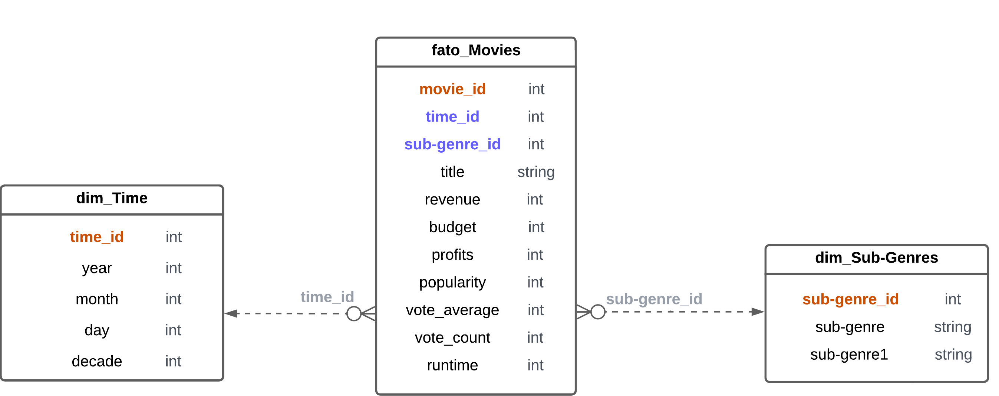
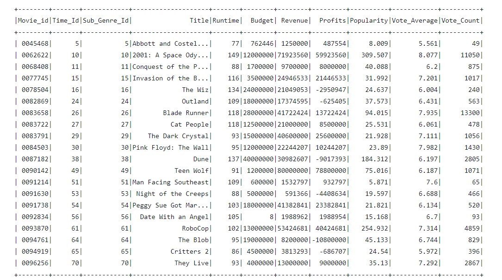
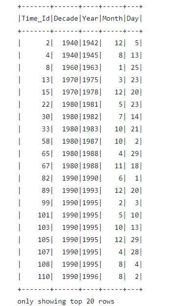
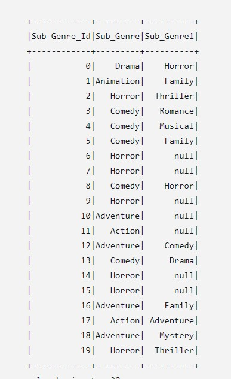
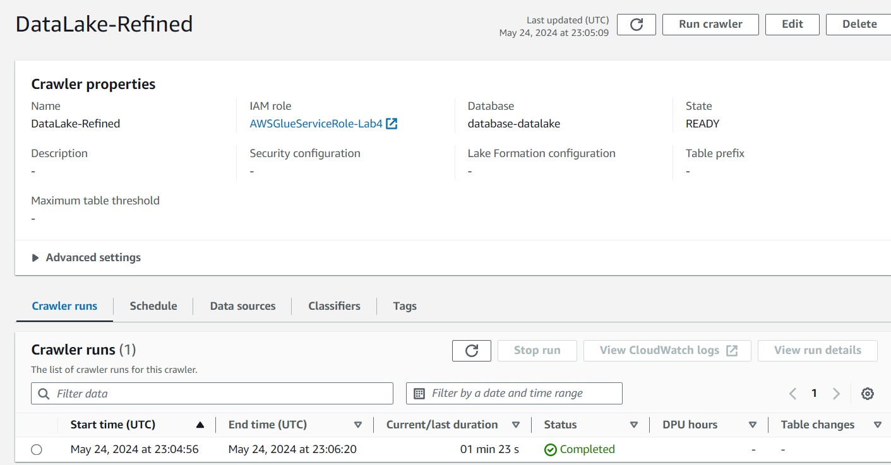

# Descrição

- Nesse arquivo será armazenado o passo a passo, comentado e com prints, da execução do desafio da Sprint e todos os códigos fonte utilizados.

- O diretório **arquivos** conterá todos os arquivos gerados no desafio, sejam eles de texto *(.txt)*, de codigo fonte *(.sh)* , etc.
- O diretório **img** conterá todos os prints tirados ao longo da execução do desafio.

## Passo a Passo

1. Nesse desafio, fizemos a camada **Refined** do nosso *data-lake*, que é a camada que possui as tabelas que iremos analisar futuramente, no modelo dimensional.

2. Para comecar, fizemos a nossa modelagem dimensional, tentando separar no nosso *Fato_Movies* os elementos quantitativos que o compõem, por exemplo, o *budget*, *revenue*, *profits*, etc, e as nossas dimensões, *Dim_Time* e *Dim_Sub-Genre* que vão conter os atributos qualitativos. 

3. Após completarmos a modelagem, podemos passar para o código, que implementará de fato as nossas tabelas. Comecamos fazendo ele localmente usando o Google Colab, e posteriormente, quando tudo já estava encaminhado, passamos para o **AWS GLUE**.

4. O nosso código vai criar as nossas 3 tabelas, o *Fato* e as duas *Dimensões*, e exporta-las em formato parquet para a nossa camada **Refined** do nosso data-lake.

5. Com a nossa camada criada, podemos então criar e rodar um *Crawler*, que pegará toda a informação das nossas tabelas e usará para popular o **AWS Data Catalog**, com as nossas tabelas.

